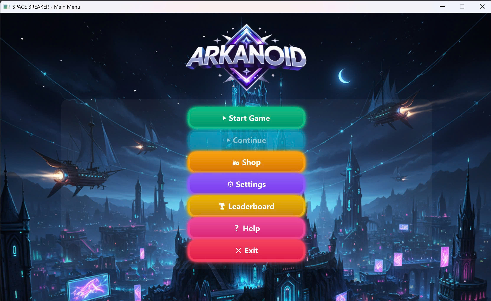
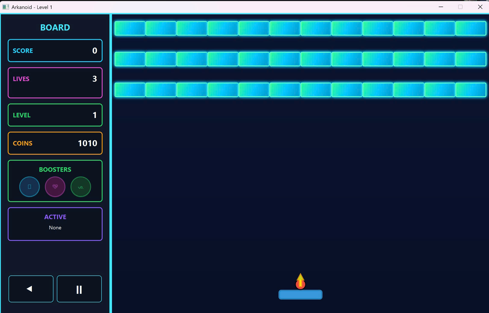
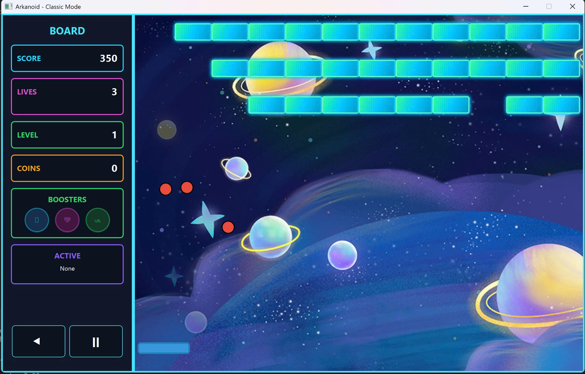
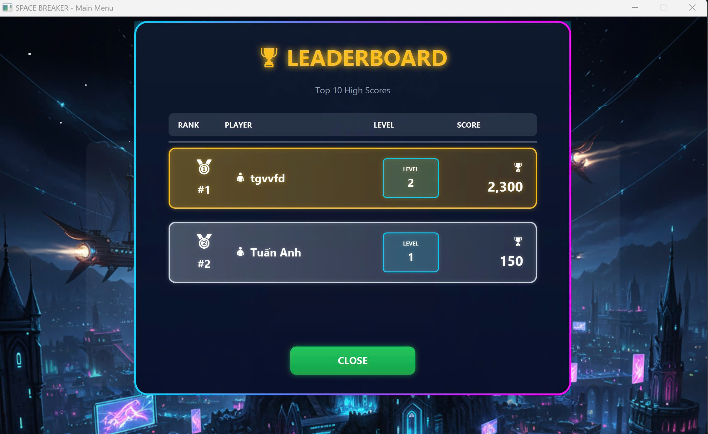
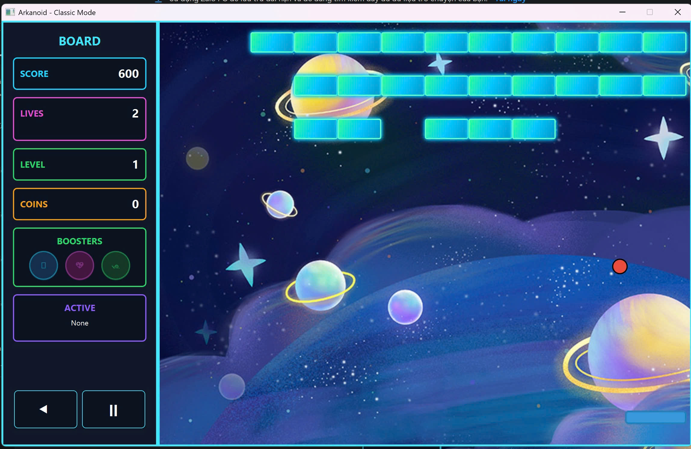

# Arkanoid Game - Object-Oriented Programming Project

## Author
Group trà cũ vị xưa - Class INT2204 11
1. Nguyễn Hữu Trường - 21021445
2. Trịnh Tuấn Anh - 24020032
3. Nguyễn Tiến Huy - 24022663

**Instructor**: Kiều Văn Tuyên
**Semester**: HK1 - Năm học 2025/2026


## 1) Giới thiệu

**Arkanoid Event** là biến thể Arkanoid cổ điển có nhiều chế độ (**event**) với gameplay, gạch (brick) và luật chơi riêng:  
**Treasure Hunter**, **Universe**, **Penaldo**, **Castle Attack**.  
Người chơi điều khiển **Paddle** hứng **Ball**, phá **Brick**, nhặt **Power-Up**, qua nhiều màn với độ khó tăng dần. Hệ thống hỗ trợ **skin**, **shop**, **story intro**, **leaderboard**, và **sound**.

**Điểm nhấn kỹ thuật/OOP**
- OOP đầy đủ: **Abstraction**, **Encapsulation**, **Inheritance**, **Polymorphism**
- Phân lớp rõ vai trò: `Engine`, `Controller`, `Loader`, `Manager`, `Model`
- Design patterns: **Singleton**, **Factory / Abstract Factory**, **Strategy**, **Observer**, **State**
- Tách **logic game** và **UI (JavaFX FXML)**, dễ bảo trì/mở rộng
- Power-Up system, GameState manager, Skin/Asset manager, Sound manager
- Màn hình chọn event/mode, story scene, tutorial, game over/congrats, leaderboard

---

## 2) Sơ đồ & tổ chức mã nguồn

### 2.1 Sơ đồ lớp (Class Diagram — tổng quan)
Sơ đồ thể hiện phân cấp **`Brick`**, **engine** theo event, **loaders**, **controllers**, **managers**.

### Class Diagram


**Các nhánh nổi bật:**
- **`Brick`** (abstract) → `ShipBrick`, `FootballBrick`, `StoneBrick`, `AlienBrick`, `GoalkeeperBrick`, `TreasureBrick`, `CanonBrick`, `GoalPostBrick`, …  
  (Có **`EnhancedBrick`** cho gạch đặc biệt)
- **Event loaders:** `EventLevelLoader` + loader mỗi event:  
  `TreasureHunterLevelLoader`, `CastleAttackLevelLoader`, `PenaldoLevelLoader`, `UniverseLevelLoader`
- **Controllers:** `EventGameController` + {`PenaldoController`, `UniverseController`, `CastleAttackController`, `TreasureHunterController`}, `MainMenuController`, `SelectEventController`, `SelectModeController`, `SelectLevelController`, `SettingsController`, `GameController`, `StorySceneController`, `TutorialDialogController`, `GameOverDialog`, `DialogResult`…
- **Engines:** `EventGameEngine` + {`TreasureHunterEngine`, `UniverseEngine`, `PenaldoEngine`, `CastleAttackEngine`}
- **Managers:** `GameStateManager`, `LeaderboardManager`, `SkinManager`, `SoundManager`, `BackgroundSelector`, `SkinController`
- **Loader khác:** `StoryLoader`, `LevelLoader`
- **Model/Game objects:** `Paddle`, `Ball`, `Soldier`, `Canon`, `Laser`, `PowerUp`, `PowerUpType`, `ActivePowerUp`, `GameState`
- **App:** `MainApp`

### 2.2 Cấu trúc thư mục 

```
arkanoid-event/
├─ pom.xml
├─ README.md
├─ docs/
│  ├─ uml/arkanoid-uml.png
│  └─ screenshots/...
├─ src/
│  ├─ main/java/
│  │  ├─ core/MainApp.java
│  │  ├─ controller/...(MainMenuController, SelectEventController, ...)
│  │  ├─ engine/...(EventGameEngine, TreasureHunterEngine, ...)
│  │  ├─ logic/...(Brick, *Brick, Paddle, Ball, PowerUp, ...)
│  │  ├─ loader/...(EventLevelLoader, *LevelLoader, StoryLoader)
│  │  ├─ manager/...(GameStateManager, SoundManager, SkinManager, LeaderboardManager, ...)
│  │  └─ util/... (StyleConstants, ...)
│  └─ main/resources/
│     ├─ fxml/...(MainMenu.fxml, GameView.fxml, SelectEvent.fxml, ...)
│     ├─ css/...
│     ├─ images/skins/, images/brick/, images/bg/
│     ├─ sfx/...
│     └─ levels/...(JSON/TXT)
└─ target/...
```

---

## 3) Tính năng chính

- **4 Event Modes**
   - **Treasure Hunter:** tìm/đào kho báu, map đặc trưng
   - **Universe:** bối cảnh vũ trụ, chướng ngại vật đặc thù
   - **Penaldo:** chủ đề bóng đá; gạch `GoalkeeperBrick`, `GoalPostBrick`, `FootballBrick`
   - **Castle Attack:** công thành, tường thành với độ bền và hiệu ứng riêng
- **Story Scene trước level:** hiển thị cốt truyện theo *paragraph*, hiệu ứng typing, **Skip/Next**
- **Power-Up System:** `PowerUp`, `PowerUpType`, `ActivePowerUp`
   - (ví dụ) multi-ball, laser, expand/shrink paddle, fast/slow ball, magnet, shield, fire-ball…
- **Skin & Shop:** `SkinManager`, `SkinController`, `ShopController` (mở khoá/áp dụng skin)
- **Leaderboard:** `LeaderboardManager` (lưu top điểm, dialog hiển thị)
- **Âm thanh:** `SoundManager` phát hiệu ứng không chặn UI
- **Quản lý trạng thái:** `GameStateManager` (Menu → Select Event/Mode → Story → Game → Pause → Game Over → Congrats)

---

## 4) Điều khiển

| Phím | Chức năng |
| --- | --- |
| `A` / `←` | Di chuyển Paddle trái |
| `D` / `→` | Di chuyển Paddle phải |
| `SPACE` | Thả bóng / Bắn (khi có Laser) |
| `P` / `ESC` | Tạm dừng / Mở Pause |
| `R` | Chơi lại màn hiện tại |
| `Q` | Thoát về Menu |

### Power-ups
| Icon | Name | Effect |
|------|------|--------|
| 🟦 | Expand Paddle | Increases paddle width for 10 seconds |
| 🐌 | Slow Ball | Decreases ball speed by 30% |
| 🎯 | Multi Ball | Spawns 2 additional balls |
| 💖 | Extra Life | Gain an additional life |

## 5) Cơ chế gameplay & chấm điểm

- Phá gạch thường: **+100**; gạch cứng/đặc biệt: **+300~500** (có thể cộng combo/nổ lan)
- Nhặt power-up: **+50** (tuỳ loại)
- **Combo multiplier** tăng khi không để rơi bóng
- Qua màn khi **phá hết gạch phá huỷ được** (gạch không phá được đóng vai trò chướng ngại)

---

## 6) Thiết kế & Patterns

- **Brick hierarchy**: *Inheritance* + *Polymorphism* cho va chạm/điểm/hình ảnh
- **Engine per event** (*Strategy*): thay đổi luật/logic theo mode
- **State**: quản lý *Menu / Playing / Paused / GameOver / Congrats*
- **Observer**: UI/score/leaderboard lắng nghe sự kiện game
- **Factory**: tạo `Brick`/`Level`/`PowerUp` theo cấu hình loader
- **Singleton**: `SoundManager`, `SkinManager`, `GameStateManager` (một instance toàn cục)

---

## 7) Cài đặt & chạy

### 7.1 Yêu cầu môi trường (khuyến nghị ổn định)
- **JDK 21 (LTS)**
- **JavaFX 21.0.x**
- **Maven ≥ 3.9**

> **macOS Apple Silicon:** dùng classifier `mac-aarch64` nếu thêm JAR native thủ công; với `javafx-maven-plugin` thì plugin tự chọn native theo OS.

### 7.2 Maven (`pom.xml` tham khảo)
```xml
<properties>
  <maven.compiler.release>21</maven.compiler.release>
  <project.build.sourceEncoding>UTF-8</project.build.sourceEncoding>
  <javafx.version>21.0.4</javafx.version>
</properties>

<dependencies>
  <dependency>
    <groupId>org.openjfx</groupId>
    <artifactId>javafx-controls</artifactId>
    <version>${javafx.version}</version>
  </dependency>
  <dependency>
    <groupId>org.openjfx</groupId>
    <artifactId>javafx-fxml</artifactId>
    <version>${javafx.version}</version>
  </dependency>
  <dependency>
    <groupId>org.openjfx</groupId>
    <artifactId>javafx-media</artifactId>
    <version>${javafx.version}</version>
  </dependency>
</dependencies>

<build>
  <plugins>
    <plugin>
      <groupId>org.openjfx</groupId>
      <artifactId>javafx-maven-plugin</artifactId>
      <version>0.0.8</version>
      <configuration>
        <mainClass>core.MainApp</mainClass>
      </configuration>
    </plugin>
  </plugins>
</build>
```

### 7.3 Lệnh chạy
```bash
# Làm sạch & chạy dev
mvn clean javafx:run

# Đóng gói JAR
mvn clean package
```

---
## 8) Tài nguyên & dữ liệu

- **Assets:** `resources/images` (skin/brick/bg), `resources/sfx` (sound), `resources/css` (style)
- **Levels:** `resources/levels/*.json` (loader đọc & build map)
- **Story:** `StoryLoader` đọc các *paragraph* cho `StorySceneController`
- **Leaderboard:** lưu JSON (đề xuất `resources/data/leaderboard.json`)

---

## 9) Screenshot & Demo

### Screenshots

**Main Menu**  


**Gameplay**  


**Power-ups in Action**  


**Leaderboard**  


### Video Demo
[](src/demo/gameplay.mkv)

*Full gameplay video is available in `src/demo/gameplay.mkv`*

## 10) Kế hoạch mở rộng

- **Boss cuối world**, **Achievement**, hiệu ứng **Particle/FX** nâng cao
- **Time Attack**, **Endless/Survival**, **Co-op/Versus 2 người**
- **Online leaderboard** (REST + DB), **replay/ghost**, **analytics**

---

*Last updated: [13/11/2025]*


